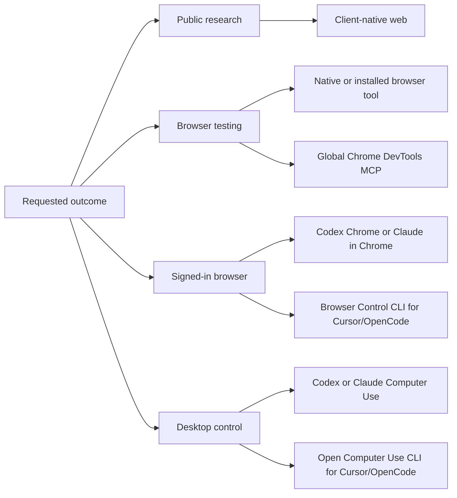

# Cross-client capability routing

Status: complete; the global plugin-first baseline is applied and verified, with
service authentication retained as an intentional first-use boundary

Branch: `plan/capability-ecosystem-routing`

## Outcome

AI-console standardizes outcomes and safety policy across Codex Desktop/CLI/IDE,
Claude Code, Cursor Agent CLI, and OpenCode without pretending the clients expose
the same product surface.

The routing order is:

1. use a sufficient native client capability;
2. otherwise use an installed, useful plugin;
3. otherwise use the globally configured MCP integration;
4. otherwise use a narrow installed CLI.

The registry is global. It does not select capability or MCP profiles per
repository; the tracked repository entries keep `mcpProfiles: []`. A client may
still impose its own consent boundary, such as enabling Claude Code's built-in
Computer Use server in an interactive project session or loading a browser
extension manually. Those client-owned choices are reported as prerequisites,
not modeled as ai-console profiles.



The selected integrations are globally configured so they are immediately
discoverable in every client. Clients still invoke them only for relevant tasks,
and native tools or installed plugins suppress duplicate MCPs. Users ask for
outcomes; they do not need to know provider or profile names.

## Final capability layout

| Outcome | Preferred path | Cross-client fallback | Activation |
| --- | --- | --- | --- |
| Current library docs | installed Claude/Cursor Context7 plugins | Context7 MCP, then public web | global, lightweight |
| Public research | each client's native web/search | Codex Browser plugin where present | lazy |
| Browser testing | Codex Browser/Chrome; installed client plugins | Chrome DevTools MCP | globally configured; invoked on demand |
| Signed-in browser | Codex Chrome; Claude in Chrome | Browser Control CLI for Cursor CLI/OpenCode | client or extension consent on first use |
| Desktop control | Codex Computer Use; Claude built-in Computer Use | Open Computer Use CLI for Cursor CLI/OpenCode | client/OS consent on first use |
| Code navigation | Cursor/Claude/OpenCode native code and LSP tools | `rg` and ordinary client file tools | on demand |
| GitHub | Codex GitHub plugin | authenticated `gh`, then `git` | immediately available |
| Jira/Confluence/Compass | native connector or installed client plugin | Atlassian Rovo MCP | globally configured; OAuth on first use |
| CircleCI | installed client plugin | hosted MCP, then CircleCI CLI | globally configured; OAuth on first use |
| Datadog | installed client plugin | Datadog MCP | globally configured; OAuth on first use |
| Durable notes | human-reviewable repository docs and explicit skills | none | explicit only |
| PostgreSQL | native database integration if supplied | target-bound `psql` | explicit target + credentials |
| Terminal/agent orchestration | native subagents for bounded delegation | Herdr CLI for panes, sessions, worktrees, and handoffs | on demand |
| Long-running objective | native `/goal` in Codex, Claude, Cursor | pinned OpenCode goal plugin | lazy |

There is no framework-knowledge bundle. React, Astro, database libraries, and
similar project-specific knowledge are retrieved only when the active task asks
for them, normally through Context7 or current official documentation.

## Client-specific implementation

| Client | Native/plugin strengths retained | MCP behavior |
| --- | --- | --- |
| Codex | Browser, Chrome, Computer Use, GitHub, skills, subagents, `/goal` | all five MCPs retained because the shared config also serves the plugin-less IDE; curated Datadog/CircleCI plugins are admin-disabled |
| Claude Code | web, opt-in Claude in Chrome, opt-in built-in Computer Use, file/search tools, agents, five selected official plugins, `/goal` | CircleCI MCP only; Context7, Chrome DevTools, Datadog, and Atlassian are plugin-owned |
| Cursor Agent CLI | built-in code/web/review, installed Context7 plugin, agents/worktrees | Context7 is plugin-owned; Chrome DevTools, Datadog, Atlassian, and CircleCI remain MCP fallbacks; Browser Control and Open Computer Use are optional installed CLIs |
| OpenCode | web, optional LSP, skills, agents, custom tools, Herdr state plugin | all five MCPs retained; Browser Control and Open Computer Use are optional installed CLIs rather than baseline plugins |

Plugin-first means a verified package owns the integration when that client can
actually install it. A package may add skills, agents, hooks, or client-native
authentication; a pure wrapper still uses the client's supported distribution
and update path. MCP remains the fallback when the ecosystem has no verified
package, an administrator blocks it, or another surface sharing the same config
cannot load plugins. Tracked templates always retain the complete fallback set;
global apply suppresses a duplicate only from local evidence that its owner is
enabled. A fresh computer therefore works before any optional plugin install.

Claude Code's `computer-use` is a special built-in MCP rather than a configured
external server. Anthropic keeps it disabled until the user enables it through
`/mcp`; that choice persists in Claude's project state. Ai-console exposes the
capability and prerequisite globally but does not synthesize per-repository
state or bypass the client and operating-system approval flow.

Browser Control and Open Computer Use follow the same fallback rule as other
tools but are not silently installed. The capability resolver detects their
global executables when present. Browser Control additionally requires its skill
and manually loaded Chromium extension; both tools can reach authenticated or
desktop state, so their extension and OS permission steps remain explicit trust
boundaries.

## Skills

Skills are procedural guidance, not ambient product/framework context. They load
only when the task matches them or the user invokes them.

The shared global set is intentionally small:

- `grill-me` for rigorous questioning before a consequential decision;
- `grill-with-docs` when the questioning must be grounded in supplied/current
  documentation;
- `engineering-workflows` only for incidents, risky migrations, consequential
  architecture, or an explicit playbook request.

UI/framework skill collections remain vendored or installable but disabled. This
keeps React, Astro, shadcn, and similar knowledge out of unrelated sessions.

## Rejected code-intelligence services

Serena and Codebase Memory are retired. The controlled pilot found correct native
results, zero MCP calls for either provider, slower wall time, and roughly 300 MB
of isolated cache per provider. Keeping them installed would add schemas,
processes, cache management, and routing instructions without demonstrated value.

The removal covers:

- canonical server definitions and capability entries;
- `semantic` and `codebase` profiles for every client;
- the provider-specific pilot executor and corpus;
- global client config entries through the retired-server cleanup list;
- repository-local `.serena` state.

Basic Memory is also retired from the baseline. Durable knowledge remains in
reviewable repository documentation, instructions, or explicit skills instead
of a second local service and storage schema.

The hosted GitHub MCP was also removed after live checks in Claude, Cursor, and
OpenCode all rejected generic OAuth because GitHub does not provide dynamic
client registration. GitHub's documentation requires a PAT header or a
host-owned OAuth app. Codex already has the stronger native plugin, and every
client can use the existing authenticated `gh` CLI without storing a token in
generated files.

The measurements and reconsideration gate remain in
`docs/plans/capability-pilot-2026-09-14.md`.

## PostgreSQL boundary

PostgreSQL is not standardized as an ambient MCP. The former MCP reference server
is archived, and a database integration is unsafe without a named target,
least-privilege credentials, and an explicit read/write contract. The resolver
therefore exposes `psql` only as a target-bound fallback. A future database MCP
must be reviewed and added to a repository/profile with credentials kept outside
tracked files.

## Workflows enabled

- “Test the login flow”: the active client uses its native browser integration;
  a CLI/IDE without one uses the already configured Chrome DevTools MCP for DOM,
  console, network, and screenshot evidence.
- “Why did CI fail?”: use CircleCI to inspect the run/workflow/job/log chain, then
  ask before rerunning or cancelling anything.
- “Implement Jira ticket X”: read Jira/Confluence context, edit
  locally with native code tools, run tests, and ask before changing Atlassian.
- “Investigate the production error”: use Datadog to correlate telemetry with
  source and recent GitHub changes, and keep external mutations approval-bound.
- “Coordinate several independent investigations”: use native subagents for
  bounded delegation; use Herdr when persistent panes, agent sessions, worktrees,
  or terminal handoffs are materially useful.
- “Grill me on this decision”: load Matt Pocock's `grill-me`; add
  `grill-with-docs` when evidence must be checked against documentation.

## Files and invariants

Primary tracked inputs:

- `rulesets/core/source.md`: shared routing and safety instructions;
- `config/plugins.json`: selected plugins and duplicate-MCP ownership;
- `config/capabilities.json`: outcome-oriented implementation registry;
- `mcp/canonical.json`: one global baseline, reserved profile infrastructure, and
  retired names;
- `registry/repos.json`: future per-repository overrides, empty by default.

Invariants:

- no secrets or absolute home paths are tracked;
- selected MCPs are globally configured without tracked credentials;
- no tool writes state into a repository merely by being configured;
- native/plugin/MCP/CLI are distinct capability layers;
- external writes remain approval-bound;
- all generated client configs derive from the same canonical model;
- retired MCP names are removed from merged global configs, not merely hidden.

## Verification and rollout

Plugin-first follow-up tracker:

- [x] Audit Codex, Claude, Cursor, and OpenCode against current official plugin
  catalogs and installed state.
- [x] Install the four verified Claude replacements at user scope.
- [x] Attempt Codex Datadog and CircleCI installs and retain MCP after both were
  rejected by the account administrator.
- [x] Encode Claude/Cursor MCP ownership, Codex fallbacks, OpenCode fallbacks,
  and OpenCode's Herdr state-reporting plugin.
- [x] Add regression tests for duplicate suppression and Cursor plugin discovery.
- [x] Make suppression installation-aware so tracked templates and fresh machines
  retain every working MCP fallback.
- [x] Back up, apply globally, and verify installed client state and behavioral
  browser access.

The four additional reviewed Cursor plugins are optional enhancements, not a
rollout gate. If installed later through Cursor's supported plugin flow, rerunning
`scripts/apply-global` will remove only their proven duplicate MCP entries.

Repository verification:

```sh
scripts/test
scripts/render --check
scripts/verify --scope templates
```

Installation rollout:

```sh
scripts/ai-console plan global
scripts/backup-global
scripts/apply-global
scripts/apply-repos
scripts/verify --scope install
```

Capability checks for each client:

```sh
scripts/ai-console capabilities --client codex-cli --live
scripts/ai-console capabilities --client claude --live
scripts/ai-console capabilities --client cursor --live
scripts/ai-console capabilities --client opencode --live
```

The expected result is that Serena and Codebase Memory never appear, every
integration has an immediate global plugin or MCP path, GitHub resolves to the
Codex plugin or `gh`, and Herdr is reported as an installed cross-client CLI.
The exact MCP list varies by the plugins enabled on that computer.
OAuth-backed services are not fully usable until the user authenticates in each
client; authentication and consequential-action approval are the intentional
manual boundaries.

### Verified on 2026-09-14

- all 65 automated tests passed; render drift, template validation, installed
  configuration checks passed;
- Codex reports all five baseline MCPs enabled, while capability resolution
  prefers its Browser and GitHub plugins on Desktop/CLI;
- Claude connected to Context7, Chrome DevTools, and Datadog; Atlassian v2 and
  CircleCI correctly stop at authentication;
- Cursor reports Chrome DevTools and Datadog ready; Atlassian and CircleCI stop
  at authentication; Context7 remains plugin-owned;
- OpenCode connected to Context7 and Chrome DevTools; Datadog, Atlassian, and
  CircleCI correctly stop at authentication;
- behavioral browser smoke tests made Claude, Cursor, and OpenCode open
  `https://example.com` through their effective Chrome DevTools route and return
  `Example Domain`;
- `gh auth status` confirms a working repository-scoped GitHub login. The active
  environment token lacks `read:org`, so organization-only queries may require
  `gh auth refresh`; no authentication was broadened automatically;
- install verification has zero failures and one intentional warning for the
  preserved user-owned `teo-garcia/AGENTS.md`.
- a second global apply made no changes, proving idempotence; the pre-apply
  snapshot is `backups/20260914-155333-006190`.

### Routing follow-up verified on 2026-09-15

- all 66 automated tests passed; render drift and template verification passed;
- the capability reports keep `profiles` and `previewProfiles` empty for Claude,
  Cursor CLI, and OpenCode;
- Claude reports built-in Computer Use as available on demand through `/mcp`,
  without claiming that the client or OS permission is enabled;
- Cursor CLI and OpenCode continue to prefer the configured Chrome DevTools MCP
  for browser testing, while the absent Browser Control and Open Computer Use
  executables remain visible but inactive fallbacks;
- no global client configuration, browser extension, or OS permission was
  changed during this registry-only follow-up.

## Official documentation checked

- Codex MCP and plugins: <https://learn.chatgpt.com/docs/extend/mcp?surface=cli>,
  <https://learn.chatgpt.com/docs/plugins>
- Claude MCP, plugins, feature overview, and Chrome:
  <https://code.claude.com/docs/en/mcp>,
  <https://code.claude.com/docs/en/discover-plugins>,
  <https://code.claude.com/docs/en/features-overview>,
  <https://code.claude.com/docs/en/chrome>,
  <https://code.claude.com/docs/en/computer-use>
- Cursor plugins, marketplace security, and selected packages:
  <https://prod.cursor.com/docs/plugins>,
  <https://prod.cursor.com/help/security-and-privacy/marketplace-security>,
  <https://cursor.com/marketplace/upstash>,
  <https://cursor.com/marketplace/google-chrome/devtools-for-agents>,
  <https://cursor.com/marketplace/datadog>,
  <https://cursor.com/marketplace/atlassian/atlassian>,
  <https://cursor.com/marketplace/circleci>
- OpenCode MCP, plugin API, ecosystem, and tools:
  <https://opencode.ai/v2/docs/mcp-servers>,
  <https://dev.opencode.ai/docs/plugins/>,
  <https://dev.opencode.ai/docs/ecosystem/>,
  <https://dev.opencode.ai/docs/tools/>
- OpenCode ecosystem browser and desktop-control fallbacks:
  <https://github.com/anomalyco/browser-control>,
  <https://github.com/anomalyco/computer-use>
- Atlassian Rovo MCP: <https://support.atlassian.com/atlassian-ai-gateway/docs/get-started-with-the-atlassian-remote-mcp-server/>
- CircleCI MCP: <https://circleci.com/docs/guides/toolkit/circleci-mcp-overview/>
- GitHub MCP host authentication and client guides:
  <https://github.com/github/github-mcp-server/blob/main/docs/host-integration.md>,
  <https://github.com/github/github-mcp-server/tree/main/docs/installation-guides>
- Archived PostgreSQL reference MCP:
  <https://github.com/modelcontextprotocol/servers-archived/blob/main/src/postgres/README.md>
